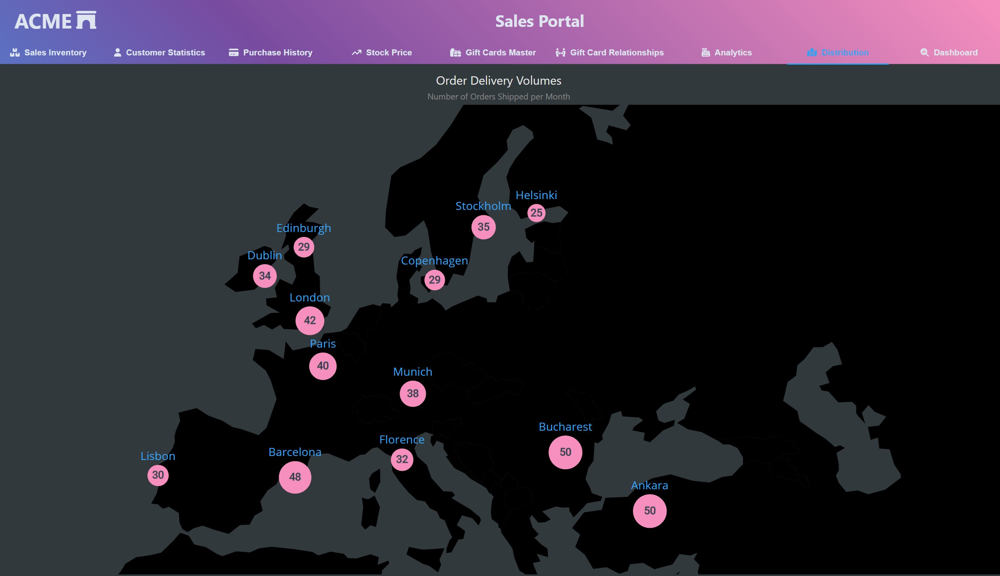

# Bubble Map

Bubble Charts are a great way to show the relative volume or size of elements that are presented on a traditional x-y axis chart. Although bubble charts can be used against traditional axes, they are also great against maps, such as the example included here. 

Maps are a great way to showcase location based data, as often in tabular data distinguishing between different parts of the world, especially if your data contains similar or same city names across the world such as London, UK versus London, Canada.

[Leaflet.js](https://leafletjs.com/) is a great Map library to call out, [which also has plugins and integrations for many frameworks, including React and Angular](https://leafletjs.com/plugins.html). However, this example uses [react-simple-maps](https://www.react-simple-maps.io/) with a custom SVG marker for the data points.