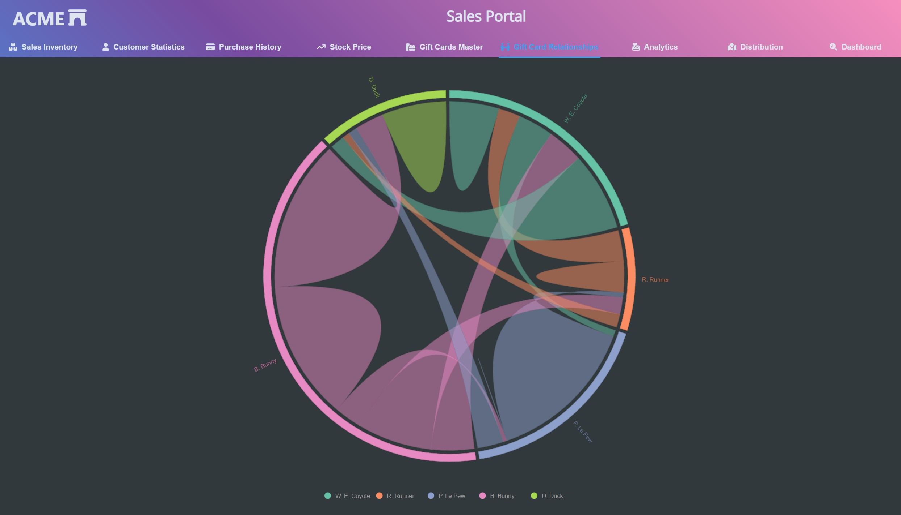

# Chord Chart

[D3.js](https://d3js.org/) is a great library for generating complex visualisations such as these, and the site does provide many examples. However, it has a steep learning curve making time to market for controls initially challenging. [Highcharts](https://www.highcharts.com/) is a great framework-agnostic option, but for the below example, I have used [Nivo](https://nivo.rocks/) which is an incredibly powerful charting library for Reach that has loads of complex chart options.

[Chord](https://d3-graph-gallery.com/chord), [Sankey](https://d3-graph-gallery.com/sankey), or Network (https://d3-graph-gallery.com/network.html) diagrams are great options for showcasing flow dependencies within networks. Chord diagrams work well for single 1-1 relationships. Meanwhile, Sankey and Network diagrams can show more complicated network flows or multi-level dependencies.