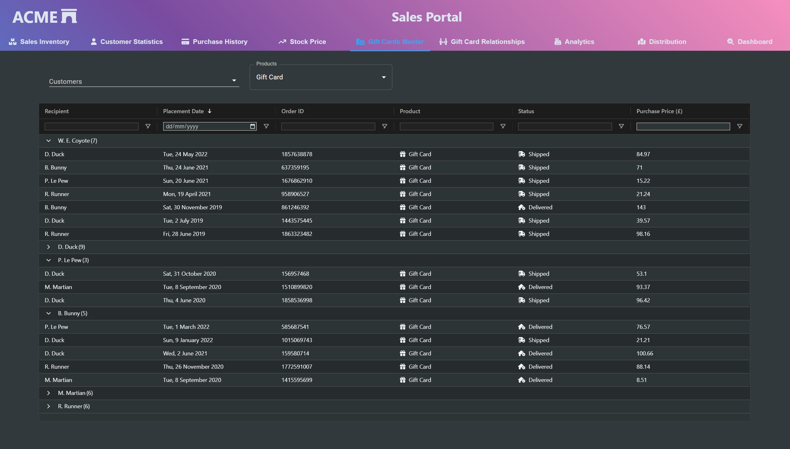

# Grouping Customer Grid

Using [AG Grid](https://www.ag-grid.com/), we see how row grouping can be used to transform relationship-related data, in this case gift card purchaser and recipient, using grouping. A similar effect for sub-details can also be achieved using the [Master/ Detail capabilities](ag-grid.com/react-data-grid/master-detail/) of many data grids, including [AG Grid](https://www.ag-grid.com/). Other grids do have grouping features available, so it's worth researching your favourite grid to see if grouping is supported and whether it is a free or paid feature.

Rather than use the [Elastic UI](https://elastic.github.io/) form controls showcased in the [sample data grid example](../SameOldDataGridView/README.md), I've showcased the Autocomplete and Select controls from [MUI](https://mui.com/) to promote reusable alternative component libraries to Elastic UI, bearing in mind that developers may need to adhere to alternative UX themes such as Material.