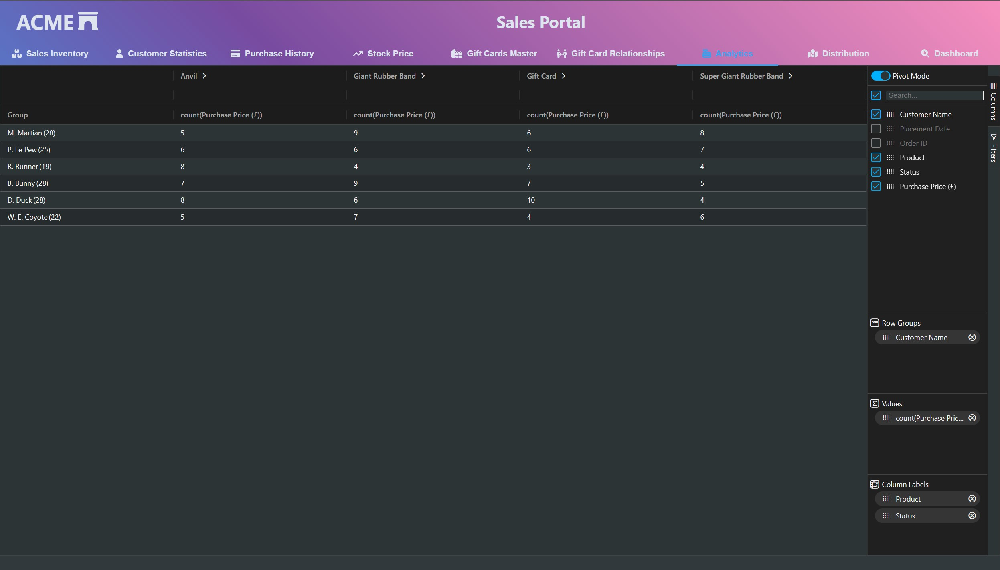

# Pivot Table

This example showcases a simple implementation of [AG Grid](https://www.ag-grid.com/), making use of its [pivot capabilities](https://www.ag-grid.com/react-data-grid/pivoting/)](https://www.ag-grid.com/react-data-grid/pivoting/). Pivot controls are useful for the open exploration of existing data sets. 

Remember that the issue we are trying to address with these examples is tackling information overload for those using our software, particularly in domains with high data volumes. Pivot tables can be a good alternative to a vanilla data grid if users need flexible reporting requirements for parties such as clients, regulators, or other partners as they allow users to tailor the data selection and aggregation level for the reporting requirement. 

Note that pivoting is an enterprise feature, which requires a license. The control is used in evaluation mode. Many other grid providers do provide this feature, but they do commonly have a cost. However, if you are looking for a free open-source alternative, controls such as [PivotTable.js](https://pivottable.js.org/examples/) may be a better fit for your use case.