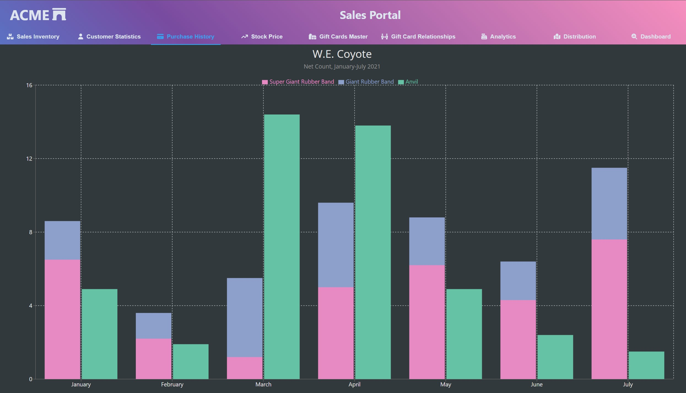

# Product Column Chart

A column chart showing single category and stackable configurations using [Recharts](https://recharts.org/). This example shows the flexibility of stacking configurations that certain chart libraries can provide. We often think it needs to be one or the other, but in fact, grouping some categories together can help you showcase the relative size of similar items compared to related categories. The example here allows you to compare all rubber band sales against anvils, as well as break out the types of rubber bands.

Bar or column charts, or histograms if you are familiar with that terminology, allow users to investigate relative increases or decreases across categories, compared to small intricate changes over time. Line charts should be used instead of column and bar charts as an indicator of position if smaller changes are of interest. An area chart is a good alternative where you need to provide users with an indication of volume.