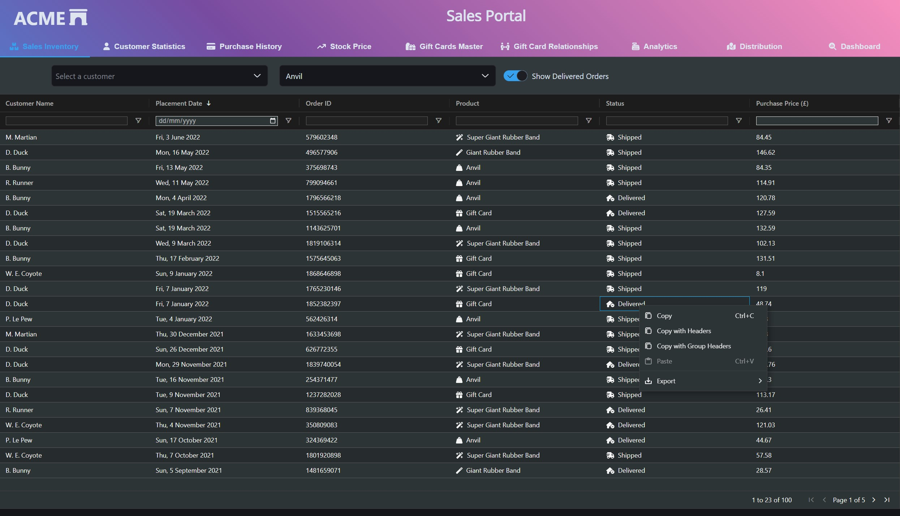

# Same Old Data Grid View

This view containing a large data grid shows the quintessential view that we build for users to allow them to analyse large data volumes. The stacked bar chart utilizes [Highcharts](https://www.highcharts.com/).[AG Grid](https://www.ag-grid.com/) is the focus point control, and in this example, we make use of custom formatters and cell renderers to make use of advanced capabilities. Although this example only shows a single grid, the author has seen many examples where multiple grids are presented in the same view.

[Elastic UI](https://elastic.github.io/) Single Select ComboBox, Single Select and Switch controls, are also presented in the toolbar to allow users to filter the data further. Often these controls are used to narrow down the volumes returned from the server.

Grids are not evil! However, rather than attempt to understand the true intent of users, or provide flexibility, we give them access to all the data. This pattern can introduce information overload into many analysis processes, and also result in users being dependent on other tools to derive meaning from the data such as spreadsheet tools.