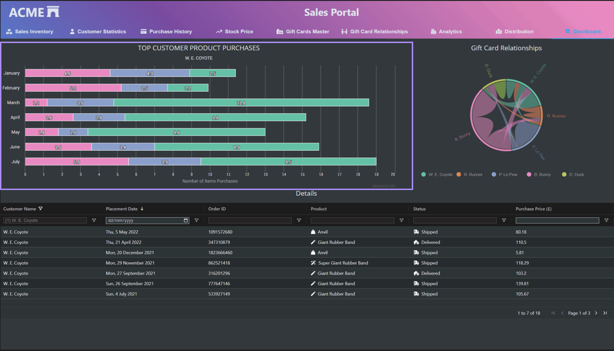

# Stacked Product Bar Chart

The Stacked Bar Chart, highlighted in the screenshot within the enclosed box as part of the [Chart Drilldown example](./src/components/ChartDrilldown/README.md), showcases a simple dashboard containing multiple charts and grids to provide users with the ability to see the underlying detail of the visualised summary data. The stacked bar chart utilizes [Highcharts](https://www.highcharts.com/).

Bar or column charts, or histograms if you are familiar with that terminology, allow users to investigate relative increases or decreases across categories, compared to small intricate changes over time. Line charts should be used instead of column and bar charts as an indicator of position if smaller changes are of interest. An area chart is a good alternative where you need to provide users with an indication of volume.