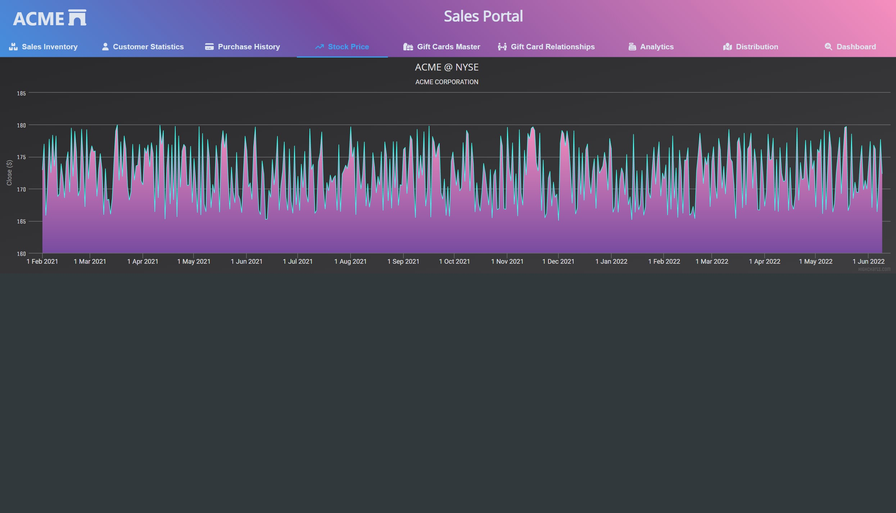

# Time Series Line Chart

The Time Series Line Chart example is a simple line chart utilising [Highcharts](https://www.highcharts.com/). The chart has zoom enabled to allow users to scrutinize small movements in the stock price trend. 

Line charts should be used as an indicator of position, whereas an area chart is a good indication of volume. Compared to column and bar charts, or histograms if you are familiar with that terminology, they allow users to investigate small changes over time compared to relative increases or decreases across categories. 