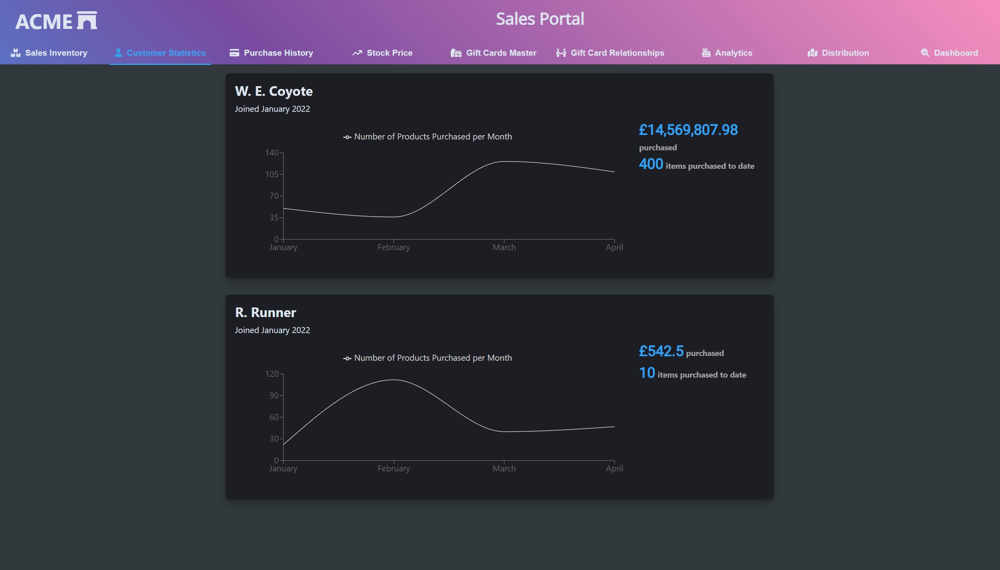

# Summary Cards

The Summary Cards example presents a simple dashboard containing cards that showcase the ability to combine visualisations with summary statistics. 

The line chart utilizes [Recharts](https://recharts.org/). While cards can be implemented using basic CSS and HTML, in this case I've chosen to highlight the cards from component library [Elastic UI, or EUI](https://elastic.github.io/eui/#/display/card) to promote reusable component libraries.

Cards are a good method to showcase multiple elements within a portfolio to present a summary of your full state. For example, if you have a portfolio of stocks or products that you manage, cards allow you to see a top-level summary of the entire portfolio. There's no reason you can't add actions to cards, or navigate to a more detailed group from the card using an interaction. 